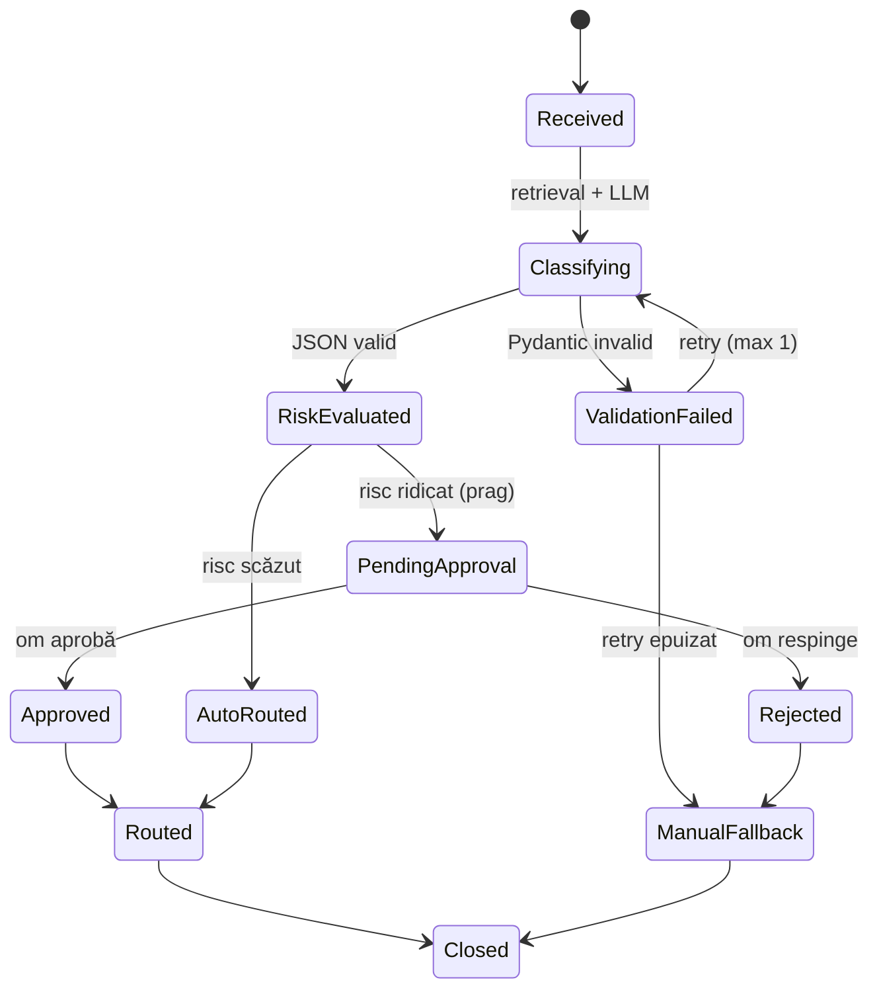
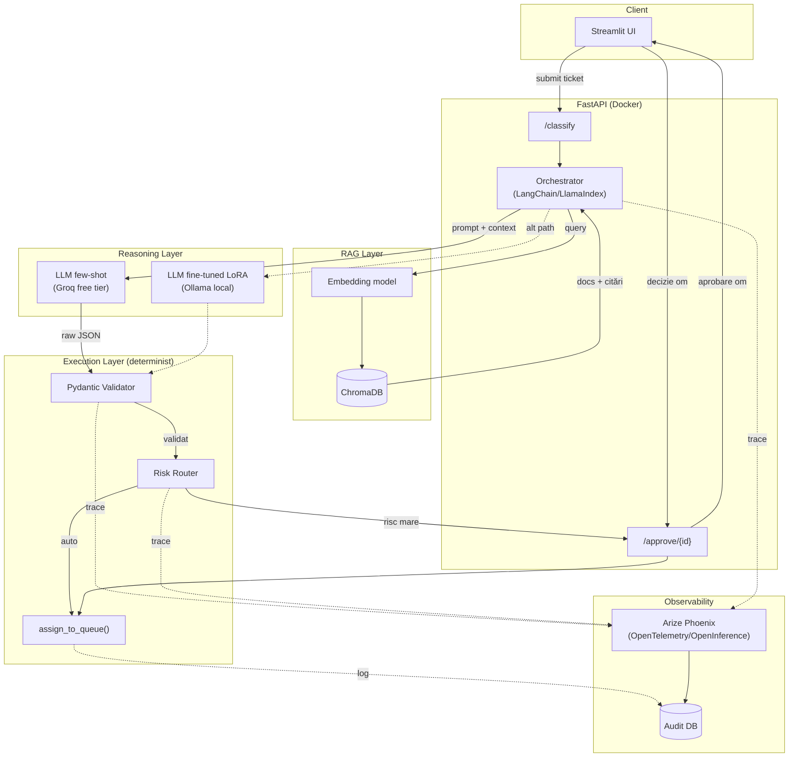
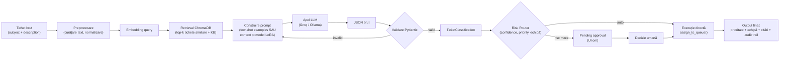
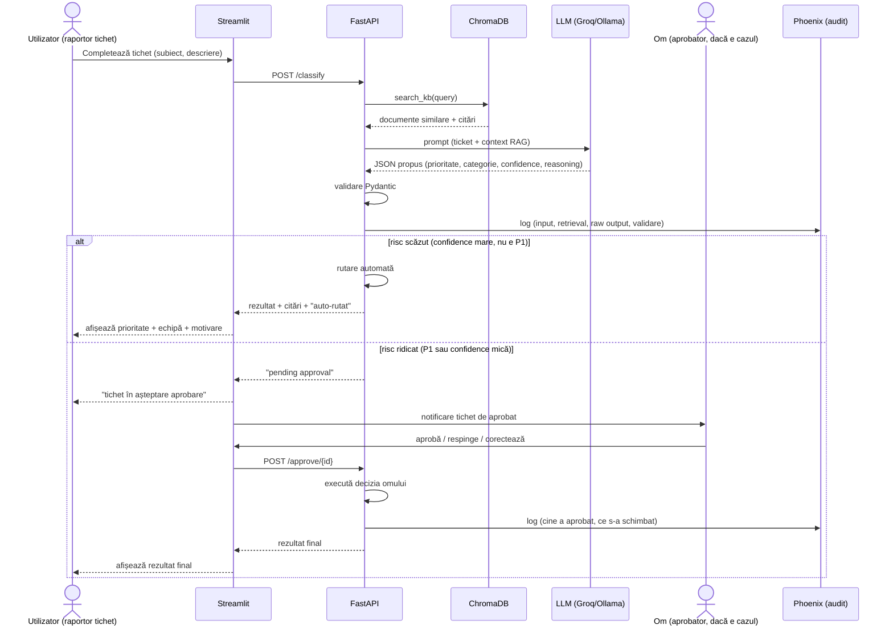

# Agent de Triaj ITSM — Documentație de Arhitectură

Capstone — AI Engineering Academy (Savnet / Atos)
Autor: Mario

---

## 1. Scop și scope

Agent care primește un tichet ITSM (text liber: subiect + descriere), îl clasifică pe
**prioritate (P1-P4)**, **categorie** și **echipă țintă**, folosind RAG pe o bază de
cunoștințe (KB de incidente istorice + playbook-uri), și decide autonom dacă
rutează tichetul automat sau îl trimite spre aprobare umană, în funcție de praguri
de risc justificate.

Din brainstorm-ul inițial (triage, diagnosis orchestrator, auto-remediation, major
incident, deflection, RCA, trend detection, KEDB, risk assessment, change
management, fulfillment, + FinOps/recruitment/bench forecast), scope-ul ales este
**doar Agentul de Triaj** — restul candidaților sunt out of scope pentru acest capstone.

---

## 2. Roluri agenți (componente logice)

Deși e un singur "agent" din perspectiva utilizatorului, intern e descompus în
sub-componente cu responsabilități separate (fiecare = un pas în orchestrator,
nu neapărat un agent LLM separat):

| Rol | Responsabilitate | LLM implicat? |
|---|---|---|
| **Retriever** | Caută în ChromaDB tichete istorice similare + articole KB relevante | Nu (embedding model) |
| **Clasificator** | Propune prioritate + categorie + echipă, pe baza tichetului + context RAG | Da (few-shot sau LoRA) |
| **Validator** | Verifică output-ul LLM contra schemei Pydantic, respinge/retrimite dacă e invalid | Nu (cod determinist) |
| **Risk Router** | Decide: auto-rutare vs. pending approval, pe baza pragurilor | Nu (cod determinist) |
| **Approval Gate** | Interfața prin care omul aprobă/respinge/corectează decizia | Nu (UI + om) |
| **Executor** | Execută acțiunea finală (rutare, notificare) după aprobare (dacă a fost cerută) | Nu (tool determinist) |
| **Audit Logger** | Scrie fiecare pas în Phoenix (trace) + DB de audit | Nu (instrumentare) |

**Regula de aur**: singurul rol care "gândește" (LLM) este Clasificatorul. Tot restul
e cod determinist, testabil unitar, fără LLM în calea critică de execuție.

---

## 3. Tool-uri (contract I/O)

| Tool | Input | Output | Validează |
|---|---|---|---|
| `search_kb(query, k)` | text tichet | top-k documente KB + scoruri + id-uri (citări) | threshold minim de similaritate |
| `classify_ticket(ticket, context)` | ticket + docs RAG | `TicketClassification` (JSON brut din LLM) | — (raw, se validează după) |
| `validate_classification(raw_json)` | JSON brut | obiect Pydantic validat sau excepție | schema, tip, valori permise (enum P1-P4) |
| `assign_to_queue(classification)` | obiect validat | id coadă/echipă țintă | echipa există în taxonomia cunoscută |
| `request_human_approval(classification, reason)` | obiect validat + motiv | ticket_id în stare `pending_approval` | — |
| `log_decision(...)` | tot pipeline-ul (input, retrieval, raw output, validare, decizie, aprobator) | trace Phoenix + rând audit DB | — |

### Schema Pydantic (contractul central)

```python
from pydantic import BaseModel, Field
from typing import Literal

class TicketClassification(BaseModel):
    priority: Literal["P1", "P2", "P3", "P4"]
    category: str
    suggested_team: str
    confidence: float = Field(ge=0.0, le=1.0)
    reasoning: str
    citations: list[str]  # id-uri documente ChromaDB folosite
```

---

## 4. Handoff-uri (cine apelează pe cine)

```
Streamlit UI
   → POST /classify (FastAPI)
       → search_kb()                      [Retriever]
       → classify_ticket(ticket, context)  [LLM: few-shot Groq / LoRA Ollama]
       → validate_classification(raw)      [Pydantic — retry 1x cu re-prompt dacă eșuează]
       → risk_router(classification)       [determinist]
           ├── auto_ok  → assign_to_queue() → log_decision() → răspuns 200
           └── risky    → request_human_approval() → stare pending → notificare UI
   → POST /approve/{id} (om aprobă/respinge din Streamlit)
       → dacă aprobat: assign_to_queue() → log_decision()
       → dacă respins: log_decision(cu motiv respingere) → stare closed_rejected
```

---

## 5. State machine



---

## 6. Diagrama de arhitectură (componente)



---

## 7. Diagrama de flux de date (input procesat → output)



---

## 8. Diagrama utilizator ↔ AI (sequence diagram)



---

## 9. Praguri de risc (justificare Human-in-the-loop)

| Condiție | Acțiune | Justificare |
|---|---|---|
| `priority == "P1"` | întotdeauna aprobare umană | impact major, cost al greșelii foarte mare |
| `confidence < 0.70` | aprobare umană | sub acest prag, rata de eroare empirică crește semnificativ (verifici pe setul de test) |
| `suggested_team` nu e în taxonomia cunoscută | aprobare umană | risc de rutare greșită completă |
| altfel | auto-rutare | risc scăzut, reversibil ușor (re-rutare manuală ulterioară) |

*(Pragul de 0.70 se calibrează empiric pe setul de validare — se documentează în raport cu graficul precision/recall vs. threshold.)*

---

## 10. Comparație few-shot vs. LoRA — plan de evaluare

1. **Set de test**: subset fix de tichete mock (ex. 15-20%), nevăzute de modelul LoRA la fine-tuning.
2. **Metrici**: accuracy, F1 per clasă (P1-P4 sunt dezechilibrate — F1 macro contează mai mult decât accuracy brută), matrice de confuzie.
3. **Timp de inferență** per tichet (ms), pentru fiecare abordare.
4. **Consum simulat** (tokeni input/output, chiar dacă e gratis) — pentru secțiunea FinOps.
5. Tabel final: `metodă | accuracy | F1 macro | timp mediu | tokeni medii`.

---

## 11. KPI-uri și baseline

- **Acuratețe clasificare**: few-shot vs. LoRA (secțiunea 10).
- **% intervenție umană**: nr. tichete `pending_approval` / total tichete.
- **MTTR simulat**: timp estimat până la rutare corectă — comparat cu baseline manual (rutare random/round-robin pe aceleași date).
- **Rata de auto-rezolvare**: nr. tichete rutate automat fără eroare / total.

Tabel comparativ final: `baseline manual | agent (few-shot) | agent (LoRA)`.

---

## 12. Structură de directoare propusă

```
triaj-agent/
├── data/
│   ├── mock_tickets.csv          # 200-500 tichete generate
│   ├── kb_articles/               # documente pentru RAG
│   └── test_set.csv               # subset ground-truth, ne folosit la fine-tuning
├── src/
│   ├── orchestrator.py            # LangChain/LlamaIndex pipeline
│   ├── schemas.py                 # Pydantic models
│   ├── tools/
│   │   ├── retrieval.py
│   │   ├── validator.py
│   │   ├── router.py
│   │   └── executor.py
│   ├── llm/
│   │   ├── few_shot.py            # client Groq
│   │   └── lora_client.py         # client Ollama
│   └── observability.py           # setup Phoenix/OpenInference
├── api/
│   └── main.py                    # FastAPI
├── ui/
│   └── app.py                     # Streamlit
├── eval/
│   ├── ragas_eval.py
│   └── classification_eval.py
├── docker-compose.yml
└── README.md
```

---

## 13. Instrumentare OpenTelemetry/OpenInference (pentru Phoenix)

- Framework: LangChain (recomandat — integrare `openinference-instrumentation-langchain` matură) sau LlamaIndex (`openinference-instrumentation-llama-index`).
- Fiecare span de trace trebuie să conțină: input tichet, query retrieval, documente returnate + scoruri, prompt final, output brut LLM, rezultat validare, decizia router-ului, (dacă e cazul) cine a aprobat și ce a schimbat, acțiunea executată finală.
- Phoenix rulează local (Docker) — UI web unde poți căuta/filtra trace-uri per tichet.

---

## Notă privind riscul de scop

Combinația LoRA fine-tuning + zero cost + termen de capstone solo e punctul cel mai
fragil al planului — necesită GPU (local sau Colab gratuit) pentru antrenare, apoi
export/conversie pentru servire prin Ollama. Recomandare: implementează întâi
few-shot (funcțional, complet), apoi LoRA ca etapă separată — dacă timpul nu ajunge,
raportezi comparația parțial (ex. doar pe un subset mic antrenat) în loc să riști
tot livrabilul.
